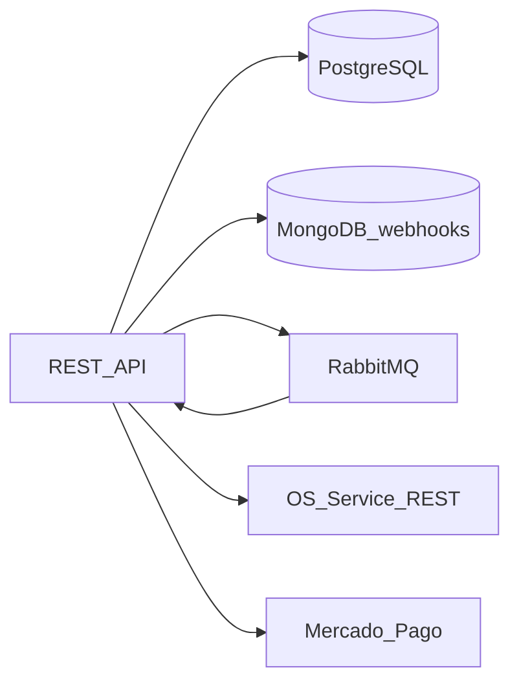

# Arquitetura — Billing Service

## Bounded context

Orçamentos, pagamentos Mercado Pago, webhooks idempotentes (MongoDB).

```mermaid
flowchart LR
  API[REST_API]
  PG[(PostgreSQL)]
  Mongo[(MongoDB_webhooks)]
  RMQ[RabbitMQ]
  OS[OS_Service_REST]
  MP[Mercado_Pago]
  API --> PG
  API --> Mongo
  RMQ --> API
  API --> RMQ
  API --> OS
  API --> MP
```

Ver [saga-events.md](saga-events.md).
